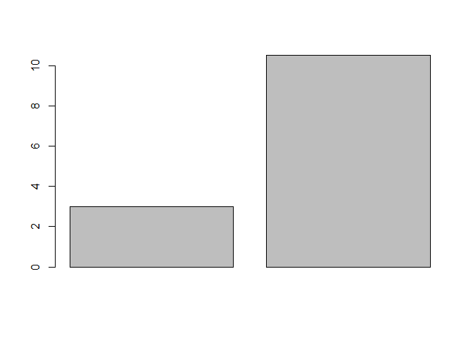
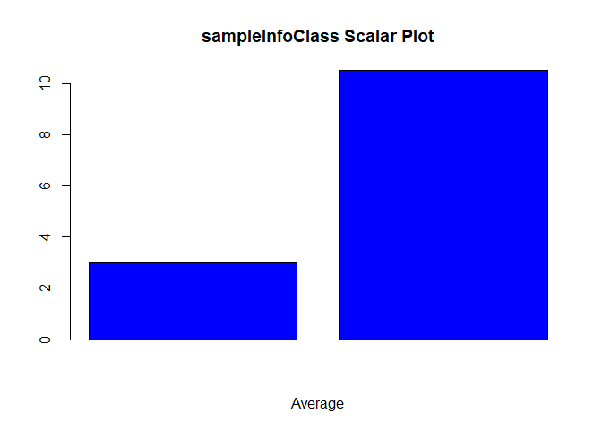

Comparing MCMC Runs - Test Tasks
--------------------------------

This is a demonstration of test tasks given in the Comparing MCMC runs
project at
<https://github.com/rstats-gsoc/gsoc2018/wiki/Comparing-MCMC-runs#solutions-of-tests>.

The source code can be accessed at
<https://github.com/thiloshon/GSoC-2018-MCMC>.

Object Creation
---------------

First, let's create a sampleInfoClass object.

    > infoClassObj1 <- sampleInfoClass(vector = sample(5))
    ## New sampleInfoClass instance created.

    > infoClassObj2 <- sampleInfoClass(vector = sample(20))
    ## New sampleInfoClass instance created.

Now, let's check what the objects contain.

    > infoClassObj1

    ## Reference class object of class "sampleInfoClass"
    ## Field "vector":
    ## [1] 2 4 1 5 3
    ## Field "vectorMetrics":
    ## list()

    > infoClassObj2

    ## Reference class object of class "sampleInfoClass"
    ## Field "vector":
    ##  [1]  2 15 11  4  5  6 18 16 14  9  1 13 19 10 17  7  8 12  3 20
    ## Field "vectorMetrics":
    ## list()

Now, let's create a sampleInfoCollectionClass object and check the
content.

    > infoCollection <- sampleInfoCollectionClass(sampleInfoClasses = list(infoClassObj1, infoClassObj2))
    ## New sampleInfoCollectionClass instance created.

    > infoCollection

    ## Reference class object of class "sampleInfoCollectionClass"
    ## Field "sampleInfoClasses":
    ## [[1]]
    ## Reference class object of class "sampleInfoClass"
    ## Field "vector":
    ## [1] 2 4 1 5 3
    ## Field "vectorMetrics":
    ## list()
    ## 
    ## [[2]]
    ## Reference class object of class "sampleInfoClass"
    ## Field "vector":
    ##  [1]  2 15 11  4  5  6 18 16 14  9  1 13 19 10 17  7  8 12  3 20
    ## Field "vectorMetrics":
    ## list()

Great! The two sampleInfoClasses are in the object.

Methods and Object Manipulation
-------------------------------

Now let's try to calculate the mean of the objects in infoCollection.

    > infoCollection$calculateScalar(FUN = mean)

    ## [[1]]
    ## [1] 3
    ## 
    ## [[2]]
    ## [1] 10.5

And calculate the max as well.

    > infoCollection$calculateScalar(FUN = max)

    ## [[1]]
    ## [1] 5
    ## 
    ## [[2]]
    ## [1] 20
    

    > infoCollection

    ## Reference class object of class "sampleInfoCollectionClass"
    ## Field "sampleInfoClasses":
    ## [[1]]
    ## Reference class object of class "sampleInfoClass"
    ## Field "vector":
    ## [1] 2 4 1 5 3
    ## Field "vectorMetrics":
    ## $mean
    ## [1] 3
    ## 
    ## $max
    ## [1] 5
    ## 
    ## 
    ## [[2]]
    ## Reference class object of class "sampleInfoClass"
    ## Field "vector":
    ##  [1]  2 15 11  4  5  6 18 16 14  9  1 13 19 10 17  7  8 12  3 20
    ## Field "vectorMetrics":
    ## $mean
    ## [1] 10.5
    ## 
    ## $max
    ## [1] 20

As you can see, two new list elements are present in the vectorMetrics,
namely, `$mean` and `$max`.

Plotting and Object Visualization
---------------------------------

Now, at last, let's create a simple plot for the average of the objects.

    > infoCollection$generatePlot(metric = "mean")

And a plot with custom plot settings.

    > infoCollection$generatePlot(
        metric = "mean",
        barplot,
        main = "sampleInfoClass Scalar Plot",
        xlab = "Average",
        col = "blue"
        )

